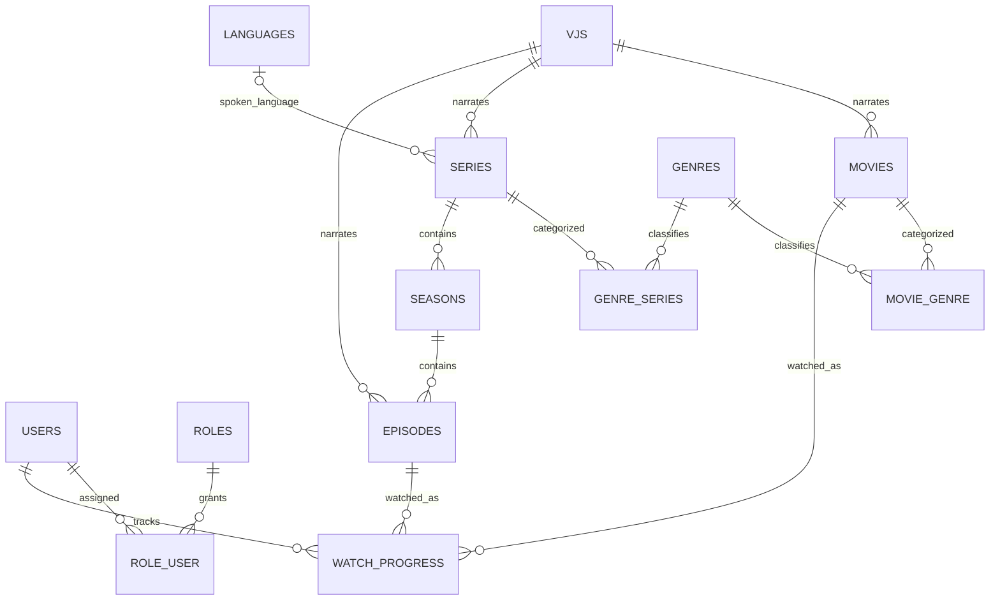

# VJFlix Database Design

The application uses PostgreSQL through Laravel's `pgsql` connection. The schema separates catalog metadata, people and taxonomies, episodic content, and per-user viewing state.

## Entities

- `users` stores viewer accounts and profile preferences. `role_user` links users to reusable `roles`; the legacy `users.role` field remains for compatibility.
- `vjs` stores Ugandan video jockey profiles. Movies, series, and episodes can reference a VJ; deleting a VJ leaves the content intact and clears that optional reference.
- `movies` stores standalone translated films, including catalog metadata, poster/backdrop paths, trailer and playback URLs, publication state, and aggregate view/rating counters.
- `series`, `seasons`, and `episodes` model episodic content. A series has ordered seasons, and each season has ordered episodes. Unique constraints prevent duplicate season numbers per series and duplicate episode numbers per season.
- `genres` and `languages` are reusable catalog taxonomies. `movie_genre` and `genre_series` implement many-to-many classification. Series may have an optional language reference.
- `watch_progress` stores each viewer's latest playback position. Its unique key is `(user_id, watchable_type, watchable_id)`, with a polymorphic target for movies or episodes and a user foreign key that cascades on account deletion.

## Integrity Notes

- Foreign keys protect the relational links; content-owned pivots and child records cascade when their parent is deleted, while optional VJ/language links are set to null.
- Video and image files are represented by URLs or storage paths, not stored as database blobs.
- Ratings are currently aggregate fields on catalog records; there is no per-user rating ledger. Subscription and payment gateway settings exist, but transactional subscription/payment tables are not yet implemented.
- The `watch_progress` polymorphic media reference cannot use a conventional foreign key to both `movies` and `episodes`; application validation checks the referenced media record.